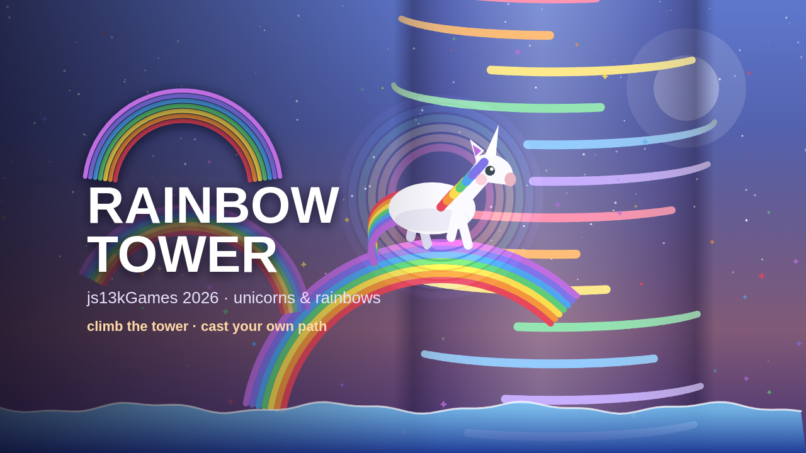

# 🌈 Rainbow Tower

A cute unicorn climbs an endless, rotating **rainbow tower** out of a candy sea.
Cast rainbows to build your own platforms, bounce off elastics, grab a jetpack and
fly, and climb as high as you can. The sea laps across the starting floor and never
rises — but touch it once and the run is over.

Entry for the **[js13kGames 2026](https://js13kgames.com/)** competition —
theme **“Unicorns & Rainbows”**. The whole game ships as a single self‑contained
HTML file under **13 KB** zipped (no assets, no dependencies at runtime).

---

## ▶️ Play

Open **`src/index.html`** in any modern browser — the source is directly playable.
For the competition build (minified + packed), run the build and open
`dist/index.html`.

### Controls

| Action | Keyboard | Touch | Gamepad |
| --- | --- | --- | --- |
| Run around the tower | ◄ ► / A D | drag left / right | stick / d‑pad ◄ ► |
| Jump (double‑jump in air) | ↑ / W | tap / hold anywhere | **A** or d‑pad ▲ |
| Cast a rainbow | **Space** / V | 🌈 pad | **B / X / Y** |
| Open umbrella (slow fall) | hold ↑ / W after the double jump | keep holding | hold **A** |
| Dive (while flying) | ↓ / S | swipe down | stick / d‑pad ▼ |
| Mute | — | tap the 🔈 icon | — |
| Pause / resume | **Esc** | ‖ button (top right) | **Start** |
| Menu: move / confirm | ↑ ↓ / Space | tap a line | d‑pad ▲▼ / **A** |

### Pause

The title screen shows the controls for whatever you're actually holding: it
detects a gamepad (and says so with a 🎮 badge), falls back to touch hints on a
coarse‑pointer device, and shows keyboard hints otherwise. Unplug the pad and it
switches back on the next frame.

Gamepads work with no setup. Browsers hide a pad until you press a button on it,
so the **first press just wakes it** — the 🎮 badge appears on the title screen and
nothing else happens; press again to start. (A page click or key press does not
reveal a pad: it has to be the pad itself.) Stick and d‑pad both steer, and **A** doubles as "confirm" in the
pause menu while d‑pad ▲▼ move the selection.

**Esc** (or the ‖ button next to the speaker, or **Start**) freezes the run and opens a menu
with **RESUME** highlighted by default and **QUIT TO MENU** below it. Pick with
↑ ↓ and confirm with **Space**/**Enter**, or tap a line; **Esc** resumes from
anywhere in the menu. Taps outside the two rows are ignored, so a stray thumb
can't throw away a run.

### Scoring

Every run is a fresh procedural tower, seeded from the clock. Height is the
score, bonuses bank extra points, and a single all‑time best is kept locally
(guarded `localStorage`, falling back to in‑memory).

### Bonuses

- ⭐ **Rainbow Rush** — brief invincible rainbow storm with an **unlimited magic
  gauge** (casting costs nothing), ×2 score, and a safety net: if you fall with
  nothing below, a rainbow appears to catch you. Rainbows themselves behave
  exactly as they always do — same cooldown, same lifetime.
- 🚀 **Rocket** — one‑shot blast to the top of the screen, then a rainbow
  parachute floats you gently back down onto a platform.
- 🎒 **Jetpack** — a few seconds of free flight in any direction, invincible,
  twin thrusters spraying rainbow flame.

### Platforms

Candy‑coloured ledges, horizontally **moving platforms**, spring **elastics**
(bouncier the harder you land, with chain‑bounce momentum), and spike hazards.

---

## 🛠 Run

```bash
nvm use && pnpm install && pnpm run dev
```

## 🛠 Build

```bash
nvm use && pnpm install && pnpm run build
```

The build:

1. extracts the game `<script>` from `src/index.html`,
2. minifies it with **Terser** (aggressive settings),
3. packs it with **Roadroller** (self‑extracting eval),
4. re‑inlines it into a minimal HTML shell (CSS + DOM are taken from the source,
   so there’s a single source of truth),
5. writes `dist/index.html` and zips it, printing the byte count against the
   **13 312 byte** budget.

> The zip step uses the `zip` CLI (macOS/Linux). On Windows, zip `dist/index.html`
> yourself, or wire in a Node zipper. For a few extra bytes on submission, run the
> final zip through [` effect ` / `advzip` / `ect`] instead of plain `zip -9`.

---

## 🎨 Cover & icon



Artwork lives in `media/` and is generated, not hand-drawn — `media/art.html`
redraws the game's own unicorn, rainbows and candy ledges on a canvas, and
`media/make.mjs` screenshots it headlessly:

```bash
nvm use && node media/make.mjs
```

The two submission images are size-capped: `media/shrink.py` (python3 + Pillow)
re-encodes them with a palette until they fit, and asserts the pixel dimensions
never change. Everything is laid out inside an 8:5 safe area, so the 16:9 master
and the 800×500 crop both keep the title fully visible.

| File | Use |
| --- | --- |
| `media/thumbnail-320x320.png` | **submission thumbnail** — exactly 320×320, ≤64 KB |
| `media/cover-800x500.png` | **submission cover** — exactly 800×500, ≤256 KB |
| `media/cover-1280x720.png` | 16:9 master cover |
| `media/cover-1200x630.png` | social / OG card |
| `media/icon-512.png`, `icon-192.png` | full-scene square icon |
| `media/mark-512.png`, `apple-touch-icon.png` | simplified mark (rainbow arc + horn) |
| `media/favicon-32.png`, `favicon-16.png`, `favicon.ico` | favicons |

The **in-game** favicon costs no extra file: the game draws the same mark into a
32×32 canvas from its own `BANDS` palette at boot and sets it as the tab icon.

## 📁 Structure

```
rainbow-tower/
├── src/index.html      # readable, commented dev source — the single source of truth
├── build.mjs           # Terser + Roadroller pipeline
├── media/              # cover art, icons, favicons + the generator that draws them
├── package.json        # scripts: dev, build (pnpm)
├── .nvmrc              # pinned Node version
├── CLAUDE.md           # working notes for Claude Code
├── dist/               # build output (gitignored)
└── README.md
```

---

## 🧩 Tech notes

- **Fake‑3D cylinder** — the world is a vertical cylinder. The hero stays centred
  at the front; moving rotates the tower. Points project with
  `sx = W/2 + R·sin(a)`, depth `d = cos(a)`, so ledges curve around the surface
  and dim toward the silhouette. No WebGL.
- **Everything procedural** — no image/audio assets. Art is canvas paths; sound is
  WebAudio: one bus with a feedback delay and a single noise buffer that every
  drum, whoosh and splash is filtered out of. Each action has its own voice
  (ground vs double jump, landing weight, casting, stomps that climb with the
  combo, springs that climb with the chain) and each power‑up gets a jingle.
  The music is an 8‑section chiptune with a swung 16th grid, a drum kit, and
  **layers that unlock as you climb** — intro, kit, breakdown, outro — going full
  and opening its filter during a Rainbow Rush, and ducking under the pause menu.
- **Seeded RNG** (`mulberry32`) drives the whole tower, so a run is fully
  determined by its seed.
- **Local high scores** via `localStorage` (guarded — falls back to in‑memory).
- **Tuning** — every feel knob lives in one `CFG` object at the top of the script
  (gravity, jump, rainbow arc, spring, colour decay, trail length…).
  Balance the game by editing numbers there, then rebuild to check the size.

---

## 📦 Submitting to js13k

The competition weighs a **zip ≤ 13 312 bytes** containing `index.html`.
`nvm use && pnpm run build` produces exactly that at `dist/rainbow-tower.zip`.

## License

MIT © Nicolas Bonnici
